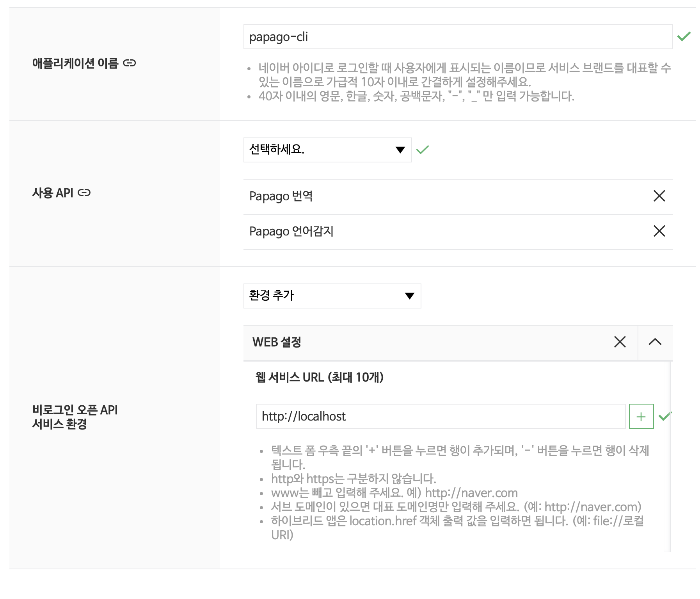

## Install

1. Create your PaPago API Key on the site below

   [go get key](https://developers.naver.com/apps/#/register)

 

2. update the variables in index.js

   - CLIENT_ID
   - CLIENT_SECRET

3. npm install -g

---

## Usage

enter "papago" at your prompt.

